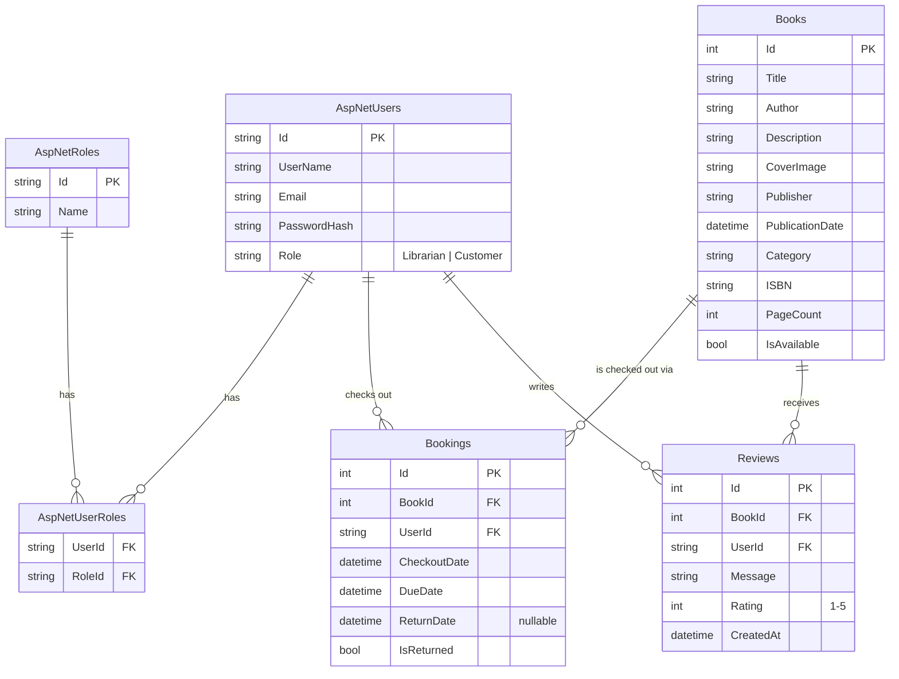

# Database Diagram

Entity-relationship diagram for the `LibraryDB` SQL Server database, generated by EF Core code-first migrations (see [Migrations](../LibraryApp/Migrations)). Renders natively on GitHub.

## Notes

- `AspNetUsers`, `AspNetRoles`, and `AspNetUserRoles` are created by ASP.NET Core Identity (`IdentityDbContext<ApplicationUser>`). `ApplicationUser` extends `IdentityUser` with a single custom `Role` column used for quick role checks; the same role is also reflected through the standard Identity `AspNetUserRoles` join table, which backs the `[Authorize(Roles = "...")]` checks on the API controllers.
- `Books.IsAvailable` is a denormalized flag kept in sync with `Bookings`: it flips to `false` when a `Booking` is created and back to `true` when that booking's `IsReturned` is set. Since each book has only one copy, at most one open (`IsReturned = false`) `Booking` can exist per book at a time.
- A `Booking`'s `DueDate` is always `CheckoutDate + 5 days` (see [BookingsController.cs](../LibraryApp/Controllers/BookingsController.cs)).
- Deleting a `Book` cascades to its `Reviews` and `Bookings` (default EF Core FK behavior for required relationships).
